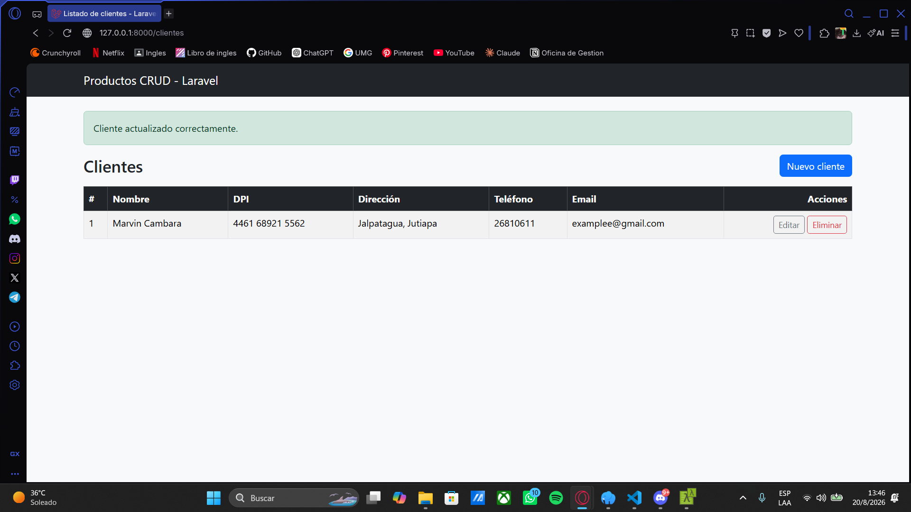
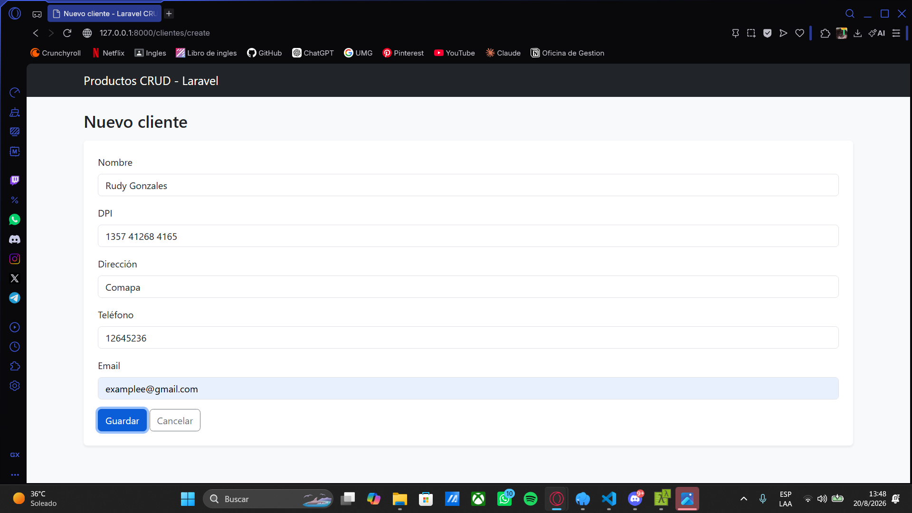
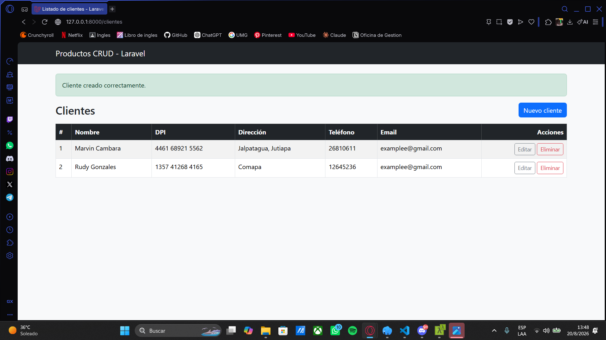
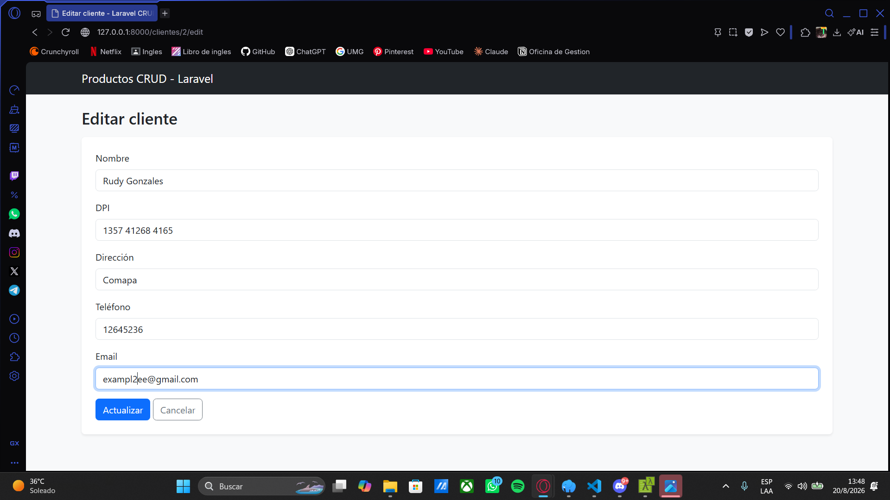
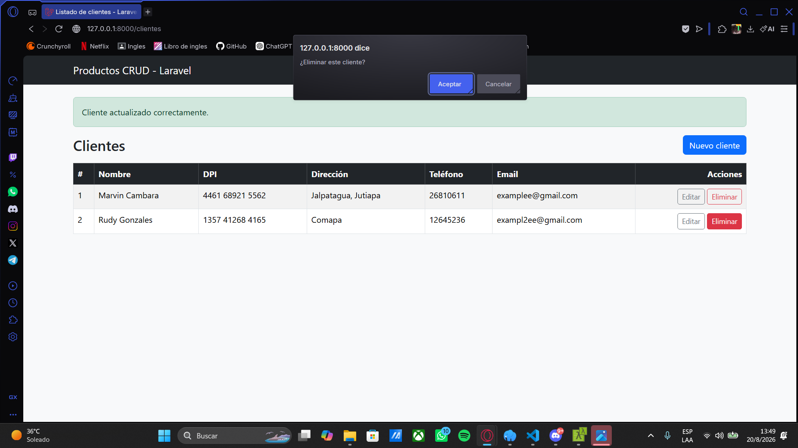
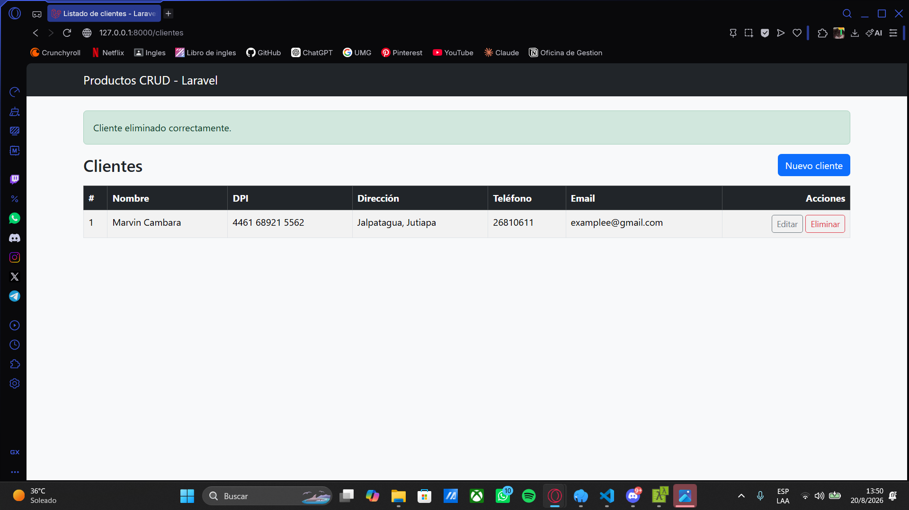

# Productos CRUD — Laravel

CRUD de productos (crear, listar, editar, eliminar) hecho con Laravel +
Eloquent + Blade, usando MySQL/MariaDB como base de datos y Bootstrap 5
(vía CDN) para el estilo. Es el mismo CRUD y la misma tabla `productos`
que la versión de CodeIgniter 3 (`../codeigniter-productos-crud`) — sirve
para comparar cómo resuelve cada framework exactamente lo mismo.

## Requisitos

- PHP 8.1 o superior
- Composer
- MySQL o MariaDB corriendo localmente (o accesible por red)

## 1. Instalar dependencias

Si clonaste el proyecto sin la carpeta `vendor/` (por ejemplo, si lo
copiaste sin incluirla), instala las dependencias con Composer:

```bash
composer install
```

## 2. Configurar las variables de entorno (`.env`)

Laravel lee la configuración de la base de datos desde el archivo `.env`.
Si no existe, cópialo desde la plantilla:

```bash
cp .env.example .env
php artisan key:generate
```

Abre `.env` y edita estas líneas con los datos de **tu** MySQL/MariaDB
local:

```env
DB_CONNECTION=mysql
DB_HOST=127.0.0.1
DB_PORT=3306
DB_DATABASE=productos_crud
DB_USERNAME=root
DB_PASSWORD=
```

- `DB_DATABASE`: el nombre de la base de datos (créala primero, ver paso 3).
- `DB_USERNAME` / `DB_PASSWORD`: tu usuario y contraseña de MySQL/MariaDB
  (en XAMPP/MAMP local suele ser `root` con contraseña vacía).

## 3. Crear la base de datos y las tablas

Crea la base de datos vacía (una sola vez):

```sql
CREATE DATABASE productos_crud;
```

Y deja que Laravel cree la tabla `productos` (y sus tablas internas de
sesiones, cache, etc.) ejecutando las migraciones:

```bash
php artisan migrate
```

La tabla `productos` que se crea es:

```sql
CREATE TABLE productos (
    id BIGINT UNSIGNED AUTO_INCREMENT PRIMARY KEY,
    nombre VARCHAR(100) NOT NULL,
    precio DECIMAL(10,2) NOT NULL,
    stock INT NOT NULL DEFAULT 0,
    created_at TIMESTAMP NULL,
    updated_at TIMESTAMP NULL
);
```

## 4. Levantar el servidor

```bash
php artisan serve
```

Abre [http://127.0.0.1:8000/productos](http://127.0.0.1:8000/productos) en
el navegador.

## Estructura relevante

- `app/Models/Producto.php` — modelo Eloquent.
- `app/Http/Controllers/ProductoController.php` — controlador con las 5
  acciones del CRUD (index, create, store, edit, update, destroy).
- `database/migrations/*_create_productos_table.php` — definición de la
  tabla.
- `resources/views/productos/` — vistas Blade (`index`, `create`, `edit`).
- `resources/views/layouts/app.blade.php` — layout compartido con
  Bootstrap 5 vía CDN.
- `routes/web.php` — rutas (`Route::resource('productos', ...)`).

## Notas

- El código no usa `declare(strict_types=1)` ni tipado estricto en los
  métodos del controlador/modelo a propósito — es tipado ligero,
  consistente con cómo suelen verse los ejemplos "estándar" de Laravel.
- Si ves un error `SQLSTATE[HY000] [2002] Connection refused` al abrir
  `/productos`, es porque MySQL/MariaDB no está corriendo o los datos del
  `.env` no coinciden con tu instalación local — no es un bug del CRUD.

## 🧪 Ejercicio de práctica — antes de arrancar el proyecto

**Modalidad**: por equipo — para los equipos a los que les tocó **Laravel**
en el proyecto integrador "Oficina del Agua".
**Entrega**: sábado 22 de agosto (antes de pasar a la Semana 2 — desarrollo del
proyecto).

### Objetivo

Esta carpeta es el ejemplo, no el ejercicio. La prueba de concepto es que tu
equipo tome esta misma estructura como plantilla y construya, desde cero, un
CRUD completo (crear, listar, editar, eliminar) para una **entidad distinta**
de `productos` — para practicar Eloquent, migraciones y Blade con las manos
antes de que el esfuerzo real se vaya al proyecto.

### Qué tabla elegir

Elige una entidad simple relacionada con "Oficina del Agua" — no hace falta
que sea una de las tablas finales del proyecto ni que el modelo de datos sea
definitivo, solo que sirva para practicar el flujo completo. Por ejemplo:
`clientes`, `contadores` o `tarifas`.

### Pasos (siguiendo el mismo patrón que `productos`)

1. **Migración**: `php artisan make:migration create_<entidad>_table` y
   define las columnas, siguiendo el mismo estilo que
   `database/migrations/*_create_productos_table.php`.
2. **Modelo**: `php artisan make:model <Entidad>` — un modelo Eloquent
   simple, igual que `app/Models/Producto.php` (sin lógica extra todavía).
3. **Controlador**: `php artisan make:controller <Entidad>Controller
   --resource` y completa las mismas 5 acciones que
   `ProductoController.php` (`index`, `create`, `store`, `edit`, `update`,
   `destroy`).
4. **Vistas**: crea `resources/views/<entidad>/` con `index`, `create` y
   `edit`, reutilizando `resources/views/layouts/app.blade.php` para
   mantener el mismo look con Bootstrap 5.
5. **Ruta**: agrega `Route::resource('<entidad>', <Entidad>Controller::class);`
   en `routes/web.php`.
6. Corre `php artisan migrate` para crear la tabla nueva y prueba las 4
   operaciones en el navegador antes de dar por terminado.

### Requisitos técnicos

- MySQL/MariaDB real vía Eloquent (nada de datos hardcodeados en el
  controlador).
- Validación real en el `store`/`update` del controlador (con `$request->validate()`
  o un `FormRequest` propio) — al menos un campo requerido y un tipo
  numérico o de longitud.
- Blade debe mostrar los errores de validación (`@error`) igual que
  esperarías ver en un formulario de Laravel estándar.

### Entregables

- La carpeta del CRUD funcionando (o el commit/rama correspondiente si ya
  vive en el repositorio del equipo).
- Captura de pantalla de las 4 operaciones (listar, crear, editar, eliminar)
  funcionando contra MySQL/MariaDB.

---
---

# 📋 Entrega — Actividad de práctica individual (Marvin Alexander Cámbara Alonzo)

> Todo lo que sigue de aquí en adelante es mi documentación personal para la
> actividad de familiarización con Laravel y la construcción del CRUD de
> `Cliente`. Lo anterior en este archivo es el README original que traía el
> proyecto de ejemplo.

## Sobre esta actividad

Esta actividad tenía dos partes que al inicio no me quedaron claras si eran
la misma cosa o no:

1. La actividad de "familiarización" de Canvas, que pedía ejecutar el
   proyecto de ejemplo (`productos`), explorar su estructura y documentar
   lo aprendido.
2. El ejercicio práctico que traía el propio README del proyecto, que
   pedía construir un CRUD nuevo (para una entidad sin relación con
   `productos`) usando el mismo proyecto como plantilla.

Le pregunté directamente al ingeniero y confirmó que ambas son la misma
actividad: debía explorar el proyecto de ejemplo **y** construir mi propio
CRUD para practicar. Elegí la entidad `Cliente`, pensando en el contexto
del proyecto integrador "Oficina del Agua".

## Cómo trabajé la semana

Dividí el trabajo en cuatro días, con un commit real por cada avance:

- **Martes:** instalación del entorno (Laragon, PHP 8.4, Composer, MySQL) y
  verificación de que el proyecto de ejemplo (`productos`) corriera
  correctamente.
- **Miércoles:** exploración a fondo de la estructura del proyecto
  (rutas, controlador, modelo, layout, vistas) y creación del modelo y la
  migración de `Cliente`.
- **Jueves:** construcción del controlador de `Cliente` (con sus 5
  acciones y validación), las rutas y las 3 vistas Blade. Prueba del CRUD
  completo.
- **Viernes:** documentación final, capturas de pantalla y entrega.

## Requisitos y ejecución

Son los mismos que ya describe el README original más arriba en este
archivo (PHP 8.4, Composer, MySQL, `composer install`, `.env`,
`php artisan migrate`, `php artisan serve`). El CRUD de clientes vive en
la misma app, en la ruta `/clientes`.

## Estructura que exploré

Antes de escribir código nuevo, revisé cómo estaba armado el CRUD de
`productos` para replicar el mismo patrón:

- **`routes/web.php`** — usa `Route::resource('productos', ProductoController::class)->except(['show'])`,
  una sola línea que genera automáticamente las 6 rutas del CRUD
  (index, create, store, edit, update, destroy), todas conectadas por
  convención de nombres con los métodos del controlador.
- **`app/Http/Controllers/ProductoController.php`** — cada método sigue el
  patrón: validar → operar sobre el modelo → redirigir con un mensaje
  flash. Los métodos `edit`, `update` y `destroy` reciben el modelo ya
  resuelto (`Producto $producto`) en vez de un ID suelto, gracias al
  **route model binding**: Laravel busca el registro en la base de datos
  automáticamente a partir del ID en la URL, y devuelve un 404 solo si no
  lo encuentra.
- **`app/Models/Producto.php`** — solo define `$fillable`, la lista de
  columnas que se pueden llenar por asignación masiva (`create()`/`update()`
  con un array), como protección de seguridad.
- **`resources/views/layouts/app.blade.php`** — el layout compartido, con
  `@yield('contenido')` como "hueco" que cada vista rellena, y el manejo
  de mensajes flash de sesión (`session('mensaje')`) para mostrar alertas
  de éxito.
- **`resources/views/productos/*.blade.php`** — las vistas usan
  `@extends`/`@section` para heredar el layout, `@forelse`/`@empty` para
  listar con manejo de caso vacío, `@csrf` y `@method('DELETE'/'PUT')`
  para los formularios de eliminar/actualizar (porque HTML solo soporta
  GET y POST de forma nativa), y `old()` para no perder los datos
  escritos si la validación falla.

Repliqué exactamente este mismo patrón para `Cliente`.

## Mi CRUD de Cliente

- **Migración** (`database/migrations/..._create_clientes_table.php`):
  columnas `nombre`, `dpi` (único), `direccion`, `telefono` y `email`
  (estas últimas tres opcionales con `->nullable()`).
- **Modelo** (`app/Models/Cliente.php`): `$fillable` con los 5 campos.
- **Controlador** (`app/Http/Controllers/ClienteController.php`): las 5
  acciones (sin `show`, igual que productos), con validación real
  (`$request->validate()`), incluyendo una regla `unique` sobre el DPI
  que ignora el propio registro al editar (para no bloquear guardar sin
  cambios).
- **Vistas** (`resources/views/clientes/`): `index`, `create`, `edit`,
  con el mismo layout y manejo de errores (`@error`/`$errors->any()`) que
  las vistas de productos.
- **Ruta**: `Route::resource('clientes', ClienteController::class)->except(['show'])`
  agregada en `routes/web.php`.

## Capturas de las 4 operaciones

**Listado general de clientes:**



**Crear un cliente nuevo:**




**Editar un cliente:**




**Eliminar un cliente:**




## Problemas que encontré y cómo los resolví

1. **Conflicto de versión de PHP en `composer install`.** El
   `composer.lock` del proyecto pedía PHP >=8.4.1, pero yo tenía PHP
   8.3.30 instalado con Laragon. Composer tiró varios "Problem" listando
   paquetes de Symfony incompatibles. Intenté forzar versiones más viejas
   con `composer update`, pero esto dejó el proyecto en un estado mixto
   que tronó con un error `Call to undefined function
   Illuminate\Filesystem\join_paths()`. La solución real fue instalar
   PHP 8.4 desde el propio Laragon (Quick add), cambiarlo como versión
   activa, borrar `vendor/` y `composer.lock`, y reinstalar todo limpio
   con `composer install`.

2. **MySQL no estaba corriendo.** Al migrar me salió
   `SQLSTATE[HY000] [2002] Connection refused`. Aprendí que Laragon
   necesita tener MySQL prendido ("Start All") antes de correr cualquier
   comando de Artisan que toque la base de datos. También aprendí que
   cuando le doy "Start All", Laragon **no se cierra**, solo se minimiza
   a la bandeja del sistema — al inicio pensé que se había crasheado.

3. **Migración corrida antes de guardar el archivo.** Corrí
   `php artisan migrate` sin haber guardado los cambios en el archivo de
   migración de `Cliente`, así que la tabla se creó solo con `id` y los
   timestamps, sin mis columnas. Lo resolví con
   `php artisan migrate:rollback --step=1` para revertir solo esa
   migración, y volví a correr `php artisan migrate` ya con el archivo
   guardado correctamente.

4. **Página en blanco sin ningún error visible.** Al probar `/clientes`
   la página cargaba con status 200 pero completamente vacía, sin nada
   en el código fuente. Revisé el log de Laravel, el status HTTP, limpié
   cachés de vistas — nada mostraba el error real. Al final me di cuenta
   de que era el mismo problema del punto 3 (columna faltante en la
   tabla), pero **combinado con que no había guardado el archivo del
   controlador en VS Code**: mientras el archivo no estaba guardado, PHP
   seguía sirviendo una versión vieja/vacía sin tirar ningún error. En
   cuanto guardé el archivo, apareció el error real
   (`Unknown column 'nombre'`), lo cual me permitió identificar y
   corregir el problema de raíz.

## Buenas prácticas que investigué

1. **Validar siempre en el servidor, no solo en el cliente.** El HTML
   puede tener `required`, `min`, `maxlength`, pero eso se puede saltar
   fácilmente (herramientas de desarrollador, peticiones directas). La
   validación real y confiable es la que hace `$request->validate()` en
   el controlador. Es importante porque protege la integridad de los
   datos sin importar de dónde venga la petición.

2. **Route model binding en vez de buscar el modelo a mano.** Usar
   `Cliente $cliente` como parámetro del método (en vez de recibir un ID
   y hacer `Cliente::find($id)` manualmente) evita repetir código y
   Laravel maneja automáticamente el caso de que el registro no exista
   (404). Es importante porque reduce errores y hace el código más corto
   y legible.

3. **Restricciones a nivel de base de datos, no solo en la aplicación.**
   Puse `->unique()` en la columna `dpi` desde la migración, además de la
   regla `unique` en la validación de Laravel. Es importante porque la
   base de datos es la última línea de defensa: aunque hubiera un bug en
   la validación de la aplicación, la base de datos igual rechazaría un
   DPI duplicado.

## Reflexión técnica

**1. ¿Qué fue lo que más me costó entender del framework?**

Al principio me costó entender el route model binding — no tenía claro
cómo Laravel "adivinaba" qué cliente cargar solo con poner
`Cliente $cliente` como parámetro, sin que yo escribiera ningún
`find()`. Una vez entendí que Laravel usa el nombre del parámetro y su
tipo para resolver automáticamente el modelo a partir del ID en la URL,
todo el resto del controlador tuvo mucho más sentido.

**2. ¿Qué parte de la estructura del proyecto me pareció más importante?**

La conexión entre `routes/web.php` y el controlador a través de
`Route::resource()`. Es una sola línea, pero conecta automáticamente 6
rutas distintas con 6 métodos del controlador, siempre y cuando sigas la
convención de nombres (`index`, `create`, `store`, `edit`, `update`,
`destroy`). Entender esa convención fue clave para poder replicar el
patrón en mi propio CRUD sin tener que escribir las rutas a mano una por
una.

**3. ¿Cómo funciona una petición desde que actúo hasta que obtengo respuesta?**

Por ejemplo, al crear un cliente: lleno el formulario y le doy
"Guardar". El navegador manda un `POST /clientes` con los datos del
formulario y un token CSRF. `routes/web.php` (por medio de
`Route::resource`) dirige esa petición al método `store()` de
`ClienteController`. Ahí se valida la información con
`$request->validate()`; si algo falla, Laravel regresa al formulario con
los errores y los valores que ya había escrito (gracias a `old()`). Si
todo pasa, se crea el registro con `Cliente::create($datos)` (filtrado
por el `$fillable` del modelo), se guarda en MySQL, y se redirige a
`clientes.index` con un mensaje flash de éxito. El navegador entonces
pide `GET /clientes`, el método `index()` trae todos los clientes
ordenados con Eloquent, se los pasa a la vista, y Blade arma la tabla
HTML final que veo en pantalla.

**4. Al menos 3 buenas prácticas que investigué y por qué son importantes.**

Ya las detallé arriba en la sección de "Buenas prácticas que investigué":
validación en el servidor, route model binding, y restricciones a nivel
de base de datos.

**5. Al menos un problema técnico que encontré y cómo lo solucioné.**

También ya está detallado arriba, en "Problemas que encontré y cómo los
resolví". El que más me costó diagnosticar fue el de la página en blanco
sin error visible, porque parecía no tener ninguna pista — al final
resultó ser una combinación de dos cosas (migración desactualizada +
archivo sin guardar) que se ocultaban una a la otra.

**6. ¿Qué aprendí que me será útil para el proyecto del módulo?**

Aprendí a diagnosticar problemas de forma metódica en vez de adivinar:
revisar el log de Laravel, el status HTTP en las herramientas de
desarrollador, y confirmar que los archivos estén guardados antes de
asumir que algo "no funciona sin razón". También me quedó claro el
patrón completo de un CRUD en Laravel (rutas → controlador → modelo →
vista), que es exactamente la base que voy a necesitar para el proyecto
real de "Oficina del Agua".